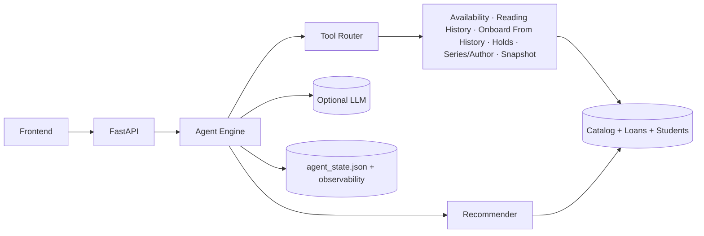

# QVest Reading Momentum POC

A proof-of-concept recommender for a school district library system. It uses lending history and the catalog to produce personalized book lists and clear rationales that librarians can trust. The POC is intentionally lightweight so it runs locally while still mirroring a production-ready architecture.

## What this demonstrates
- A collaborative-filtering style recommender based on historical co-borrowing.
- Simple, explainable rationales that can be swapped for LLM-generated explanations later.
- A minimal API plus a clean UI for demoing with partners.
- An agent engine with a tool router (availability, reading history, onboarding from history, holds, series/author, snapshot).
- Persistent agent state + observability for feedback loops.

## Architecture

The current demo runs a FastAPI backend with an agent engine + tool router, and serves the UI at `/ui`.

### Agentic + Tools Architecture


### Agentic + Tools (Slide Version)


### Production AI Architecture (Proposed)
```mermaid
flowchart LR
  subgraph Clients
    UI[Web + Mobile UI]
    ADMIN[Librarian Console]
  end

  subgraph Edge
    CDN[CDN + WAF]
    AUTH[Auth / SSO]
  end

  subgraph API
    GATEWAY[API Gateway]
    APP[Recommendation + Agent API]
    ORCH[Agent Orchestrator\n(policy + routing)]
    PROMPTS[Prompt + Context Builder]
  end

  subgraph Tools
    AVAIL[Availability Service]
    HISTORY[Reading History Service]
    HOLDS[Holds Service]
    FEEDBACK[Feedback Service]
    SNAPSHOT[Student Snapshot Service]
    SEARCH[Catalog Search]
  end

  subgraph Intelligence
    REC[Recommender Service]
    RERANK[Reranker / Personalization]
    LLM[(LLM Provider)]
    SAFETY[Safety + Policy Filters]
  end

  subgraph DataPlatform
    INGEST[Ingestion + Validation]
    WAREHOUSE[(Analytics Warehouse)]
    FEATURE[(Feature Store)]
    VECTOR[(Vector / Semantic Index)]
    REGISTRY[(Model Registry)]
  end

  subgraph Storage
    CATALOG[(Catalog DB)]
    LOANS[(Loans DB)]
    STUDENTS[(Students DB)]
    STATE[(Agent State DB)]
    LOGS[(Observability Logs)]
  end

  subgraph Ops
    EVAL[Offline Evaluation]
    MON[Monitoring + Drift]
    AB[A/B + Experimentation]
  end

  UI --> CDN --> AUTH --> GATEWAY
  ADMIN --> AUTH --> GATEWAY
  GATEWAY --> APP --> ORCH --> PROMPTS

  ORCH --> AVAIL
  ORCH --> HISTORY
  ORCH --> HOLDS
  ORCH --> FEEDBACK
  ORCH --> SNAPSHOT
  ORCH --> SEARCH
  ORCH --> REC
  ORCH --> RERANK
  ORCH --> SAFETY
  ORCH --> LLM

  AVAIL --> CATALOG
  HISTORY --> LOANS
  HOLDS --> STATE
  FEEDBACK --> STATE
  SNAPSHOT --> STUDENTS
  SEARCH --> CATALOG

  INGEST --> CATALOG
  INGEST --> LOANS
  INGEST --> STUDENTS
  INGEST --> WAREHOUSE
  INGEST --> FEATURE
  INGEST --> VECTOR

  REC --> FEATURE
  RERANK --> FEATURE
  RERANK --> VECTOR
  REC --> REGISTRY

  APP --> LOGS
  ORCH --> LOGS
  LOGS --> MON
  WAREHOUSE --> EVAL
  EVAL --> REGISTRY
  AB --> APP
```


## Repository layout
- `backend/app.py` FastAPI service (serves UI at `/ui`)
- `backend/agents/` agent engine, prompts, router, and utilities
- `backend/tools/` tool router + tool implementations
- `backend/recommender.py` co-occurrence recommender
- `backend/data_loader.py` CSV loader
- `backend/agent_state.py` persisted agent state + observability
- `backend/chat_memory.py` in-memory chat history
- `data/` sample catalog, students, and loans
- `frontend/` static demo UI
- `assets/agentic-tools-architecture.png` exported system diagram

## Quickstart
1. Create and activate the virtual environment:

```bash
python3 -m venv .qvest
source .qvest/bin/activate
```

2. Install dependencies:

```bash
pip install -r <(python - <<'PY'
import tomllib
import pathlib
pyproject = pathlib.Path('pyproject.toml').read_bytes()
config = tomllib.loads(pyproject)
print("\n".join(config["project"]["dependencies"]))
PY
)
```

3. Start the backend:

```bash
uvicorn backend.app:app --reload --port 8000
```

4. Open the frontend:
- Open `http://localhost:8000/ui/` in a browser (or `frontend/index.html`).

## API Examples
```bash
curl "http://localhost:8000/health"
```

```bash
curl "http://localhost:8000/recommendations?student_id=S001&k=5"
```

```bash
curl "http://localhost:8000/agents/tools"
```

## Agent Lab (demo)
Front-end pages:
- `frontend/agents.html` hub
- `frontend/concierge.html` librarian concierge
- `frontend/onboarding.html` student onboarding
- `frontend/holds.html` availability & holds
- `frontend/gaps.html` collection gap analyst
- `frontend/feedback.html` feedback loop

Agent endpoints:
- `POST /agents/concierge`
- `GET /agents/tools`
- `GET /agents/observability`
- `GET /agents/onboarding/{student_id}`
- `POST /agents/onboarding`
- `GET /agents/snapshot/{student_id}`
- `GET /agents/availability`
- `GET /agents/holds`
- `POST /agents/holds`
- `POST /agents/holds/{hold_id}/cancel`
- `GET /agents/collection-gaps`
- `POST /agents/feedback`
- `GET /agents/feedback`
- `GET /agents/feedback/insights`
- `GET /agents/feedback/recommendations`

Agent state persistence lives in `data/agent_state.json` (profiles, holds, feedback, observability). Chat history is in-memory per server process (`backend/chat_memory.py`).

## How the POC works
- Build a student → books map from the loan history.
- Count how often pairs of books appear together.
- Score candidate books using cosine-style similarity.
- Provide human-readable reasons based on the closest book in a student’s history.

## LLM augmentation (next iteration)
The POC includes deterministic reasons for trust and reproducibility. In production, the explanation layer can call an LLM to:
- Tailor the language to student reading level.
- Highlight connections between themes and characters.
- Suggest read-alikes and librarian talking points.

## Rollout plan (proposal draft)
1. **Discovery (2-3 weeks)**
   - Validate data quality, privacy constraints, and catalog coverage.
   - Conduct librarian workshops to define recommendation success criteria.
2. **Pilot (4-6 weeks)**
   - Run on two schools with opt-in librarians.
   - Weekly feedback loops and model tuning.
3. **District rollout (6-8 weeks)**
   - Train-the-trainer model for librarians.
   - Add dashboards for reading outcomes and engagement.
4. **Operations (ongoing)**
   - Monthly data refresh and drift checks.
   - Quarterly model review and explanation audits.

## Estimated effort (full project)
- Data pipeline + privacy review: 4-6 weeks
- Recommendation system + evaluation: 4-5 weeks
- LLM explanation service + guardrails: 3-4 weeks
- UX + change management + rollout: 4-6 weeks
- Total: 15-21 weeks (can be compressed with parallel workstreams)

## Demo story for partners
- Show how a librarian picks a student and receives a ranked list.
- Explain why each recommendation is made.
- Discuss how LLMs can personalize tone without changing the core ranking.
- Close with a roadmap for production readiness.
